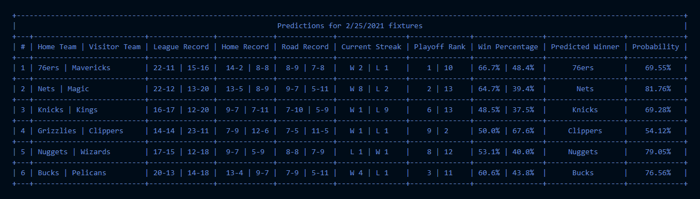
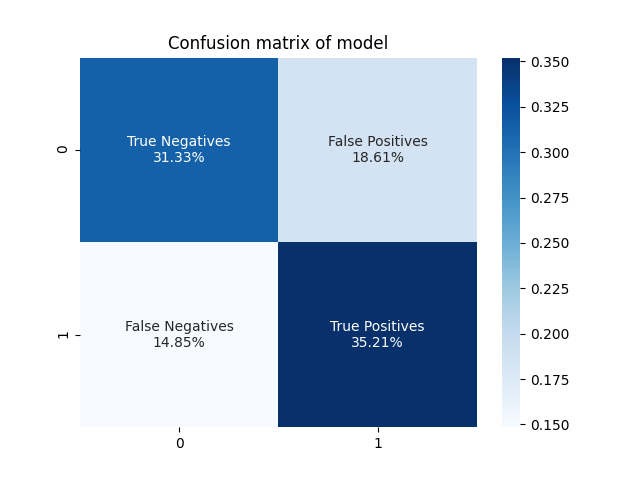
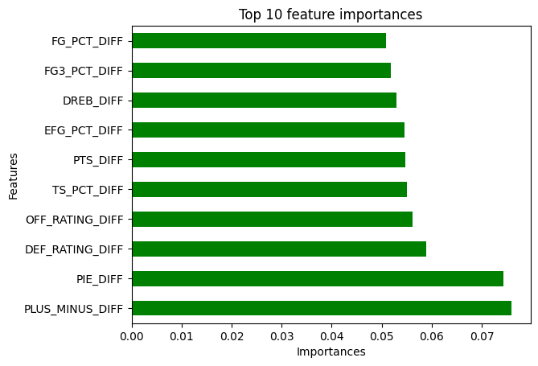
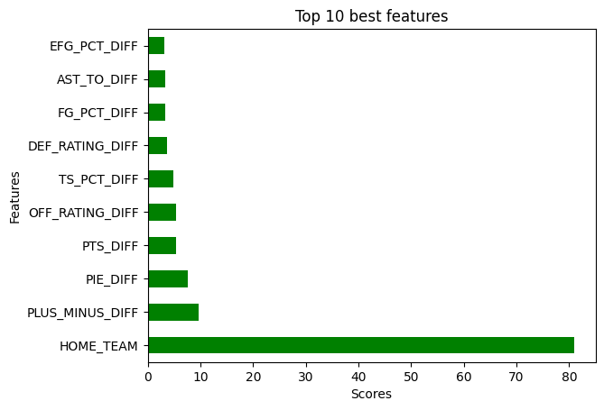

# NBA Game Prediction 

A small program made in Python 3.7.2 that can be used to predict the winners of NBA games with the aid of machine learning.

## Working Principle

This program attempts to make predictions on NBA games by utilizing an SVM (Support-vector machines) model. This has been accomplished by taking into account a number of pregame team stats from the official NBA website for randomly selected matchups between different teams from the 2000-01 season onwards and using the compiled data for the model training.

## Usage

1. Install the required Python modules listed in '*requrements.txt*'.
2. Launch the retrieval of the necessary data ('*data_retriever.py*') through '*data_retrieval_launcher.py*'.
3. Perform data normalization, data analysis and model training with '*data_processor.py*'.
4. Open '*games_predictor.py*', input the date of the games and get the predictions.

**Note:** 

   * Most of the code includes comments for clariffication.
   * To avoid uploading too many files, not all the '*csv*' files used to compile the training data have been included in the '*data*' folder.  
  
## Screenshots and Charts

